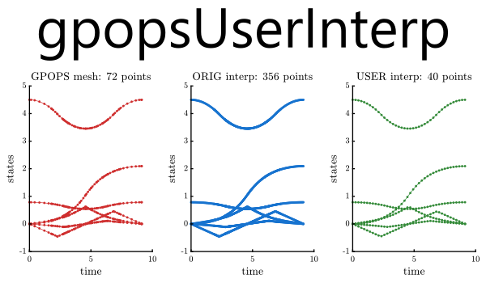

## README (gpops-user-interp)

[](https://github.com/danielrherber/gpops-user-interp/releases/latest)
[](https://www.mathworks.com/products/matlab.html)
[](https://github.com/danielrherber/gpops-user-interp/issues)
[](https://github.com/danielrherber/gpops-user-interp/graphs/contributors)

[](https://github.com/danielrherber/gpops-user-interp/blob/master/License)

Interpolate a GPOPS solution to a user-defined grid.



---
### Install
* Download the [project files](https://github.com/danielrherber/gpops-user-interp/archive/master.zip)
* Run [INSTALL_gpopsUserInterp.m](INSTALL_gpopsUserInterp.m) in the MATLAB Command Window until no errors are seen
(*automatically adds project files to your MATLAB path, checks for a required file, and opens an example*)

```matlab
INSTALL_gpopsUserInterp
```
* See [GUIex_launch.m](examples/GUIex_launch.m) for an example
```matlab
open GUIex_launch
```

### External Requirements
This project requires the commercial software GPOPS-II. It can be obtained at [gpops2.com](http://www.gpops2.com/).

---
### General Information

#### Contributors
* [Daniel R. Herber](https://github.com/danielrherber) (primary)

#### Project Links
* [https://github.com/danielrherber/gpops-user-interp](https://github.com/danielrherber/gpops-user-interp)
<!-- * [http://www.mathworks.com/matlabcentral/fileexchange/XXXXX](http://www.mathworks.com/matlabcentral/fileexchange/XXXXX) -->
